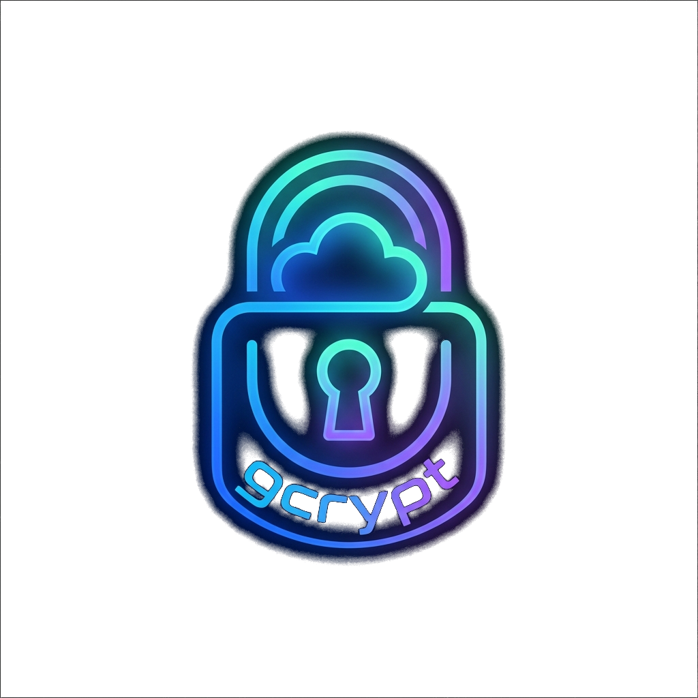

<p align="center">
  
</p>

<h1 align="center">gcrypt</h1>

[](https://opensource.org/licenses/MIT)


**gcrypt** is a Windows desktop Google Drive sync client with client-side encryption. All files are encrypted locally before being uploaded to Google Drive, ensuring that no plaintext data ever leaves your machine.

## Table of Contents

- [Features](#features)
- [Security Model](#security-model)
- [Installation](#installation)
- [Google Drive API Setup](#google-drive-api-setup)
- [Usage](#usage)
- [Accessing Your Sync on Another PC](#accessing-your-sync-on-another-pc)
- [Configuration](#configuration)
- [Architecture](#architecture)
- [Troubleshooting](#troubleshooting)
- [Development](#development)
- [Contributing](#contributing)
- [License](#license)

---

## Features

- **End-to-End Encryption** — Files are encrypted with AES-256-GCM before upload. Each file gets a unique Data Encryption Key (DEK), wrapped by a Key Encryption Key (KEK) derived from your passphrase.
- **Multi-Sync Support** — Sync multiple directory pairs simultaneously, each with independent configuration.
- **System Tray Integration** — Monitor status, manage sync pairs, and configure settings from the Windows system tray.
- **Real-Time Sync** — Automatically detects local file changes and syncs them to Google Drive.
- **Per-File Encryption Keys** — Each file uses a unique DEK, ensuring key isolation.
- **Filename Encryption** — Filenames are encrypted with deterministic nonce based on file path, enabling safe syncing while preserving searchability.
- **Auto-Start with Windows** — gcrypt starts automatically with your session.
- **Batch Operations** — Pause/Resume All, Sync All Now for quick management.
- **Configurable Sync Intervals** — Per-pair and global sync interval settings.
- **Large File Support** — Configurable maximum file size limits.
- **Comprehensive Logging** — Detailed logs with configurable levels and rotation.

---

## Security Model

### Key Derivation (Master Key)
```
Passphrase + Salt (16 bytes)
     │
     ▼
Argon2id (memory=64 MiB, iterations=3, parallelism=4)
     │
     ▼
Master Key (256 bits / 32 bytes)
```

### Per-File Encryption (Data Encryption Key)
Each file gets its own unique DEK:
```
Random DEK (256 bits)
     │
     ▼
Encrypt with Master Key (AES-256-GCM)
     │
     └─► Encrypted DEK (48 bytes: 32 ciphertext + 16 tag)
     └─► DEK Nonce (12 bytes, random)
```

### File Content Encryption
```
File Content + DEK + FilePath
     │
     ▼
Hash FilePath (SHA-256) → AAD
     │
     ▼
Generate Content Nonce (12 bytes, random)
     │
     ▼
Encrypt with AES-256-GCM (AAD = SHA-256(filePath))
     │
     └─► Content Nonce (12 bytes, stored in header)
     └─► Ciphertext (includes 16-byte GCM tag)
```

### Encrypted File Format
```
┌─────────────────────────────────────────────────────────┐
│ Magic (6 bytes):  "GCRYPT"                              │
│ Version (2 bytes): 0x0001                               │
│ Encrypted DEK (48 bytes): AES-GCM ciphertext + tag      │
│ DEK Nonce (12 bytes): Random nonce for DEK decryption   │
│ Content Nonce (12 bytes): Random nonce for file content │
├─────────────────────────────────────────────────────────┤
│ Ciphertext (variable): File content + 16-byte GCM tag   │
└─────────────────────────────────────────────────────────┘
```

### Security Features

| Feature | Implementation |
|---------|---------------|
| Key Derivation | Argon2id (RFC 9106) |
| Encryption | AES-256-GCM (NIST SP 800-38D) |
| Master Key Protection | Windows VirtualLock + NOOVERWRITE |
| Nonce Generation | crypt/rand (OS entropy) |
| File Binding | SHA-256(filePath) as AAD |
| Filename Encryption | AES-256-GCM with deterministic nonce |

---

## Installation

### Prerequisites

- Windows 10 or later (64-bit)
- Google account with Drive access
- Go 1.26.4 or later (for building from source)

### Building from Source

```bash
# Clone the repository
git clone https://github.com/yourusername/gcrypt.git
cd gcrypt

# Build the application
go build -o gcrypt.exe ./cmd/gcrypt/

# Run setup (first time only)
./gcrypt.exe -setup
```

---

## Google Drive API Setup

To use `gcrypt`, you need to set up a Google Cloud project with the Google Drive API enabled and configure OAuth client credentials. Follow these detailed steps:

### 1. Create a Google Cloud Project
1. Open the [Google Cloud Console](https://console.cloud.google.com/).
2. Click the project dropdown in the top-left corner and select **New Project**.
3. Enter a project name (e.g., `gcrypt-sync`) and click **Create**.

### 2. Enable the Google Drive API
1. Navigate to **APIs & Services** > **Library** using the left sidebar.
2. Search for **Google Drive API**.
3. Click on the Google Drive API result and click **Enable**.

### 3. Configure the OAuth Consent Screen
1. Go to **APIs & Services** > **OAuth consent screen** in the left sidebar.
2. Select **External** as the User Type (this allows you to use your personal Google account) and click **Create**.
3. Provide the required App Information:
   - **App name**: `gcrypt`
   - **User support email**: Select your email address.
   - **Developer contact information**: Enter your email address.
   - Click **Save and Continue**.
4. Configure **Scopes**:
   - Click **Add or Remove Scopes**.
   - Under *Manually add scopes*, enter: `https://www.googleapis.com/auth/drive.file`
   - Click **Add to Table** and click **Update**.
   - Click **Save and Continue**.
     > 🔒 **Privacy Note:** `gcrypt` uses the narrow `drive.file` scope. This means it can only access files and folders that it creates or that the user explicitly opens with it. It cannot read, modify, or delete any other files in your Google Drive.
5. Configure **Test Users**:
   - Google restricts unverified apps in "Testing" status to specific authorized users.
   - Click **Add Users** and enter the email address of the Google Account you wish to sync files with.
   - Click **Save and Continue**, review the summary, and return to the dashboard.

### 4. Create OAuth Client Credentials
1. Navigate to **APIs & Services** > **Credentials** in the left sidebar.
2. Click **+ Create Credentials** at the top of the page and select **OAuth client ID**.
3. Select **Application type**: **Web application**.
   > ℹ️ **Why Web application?**
   > `gcrypt` listens on a local loopback port (`http://localhost:8089/callback`) to receive the OAuth authorization code after you sign in via your web browser. A Web Application client ID is required to register this redirect URI.
4. Enter a name (e.g., `gcrypt-client`).
5. Under **Authorized redirect URIs**, click **+ Add URI** and enter exactly:
   ```
   http://localhost:8089/callback
   ```
6. Click **Create**.
7. Copy the generated **Client ID** and **Client Secret**. Keep these secure.

### 5. Configure gcrypt with Credentials
You can provide these credentials to `gcrypt` in one of two ways:

#### Method A: The Setup Wizard (Recommended)
When you run `./gcrypt.exe -setup` (or when prompted by the system tray GUI on first launch), you will be asked to enter the **Client ID** and **Client Secret**. `gcrypt` will encrypt the secret using your passphrase-derived master key and persist both in your config file (`%APPDATA%\gcrypt\config.yaml`):
```yaml
oauth:
  client_id: "YOUR_CLIENT_ID"
  client_secret_enc: "ENCRYPTED_SECRET_BASE64"
```

#### Method B: Environment Variables
If you prefer not to store credentials in your configuration file, you can set them as environment variables before starting `gcrypt`. This is especially useful for Docker container deployment or scripts:
- **PowerShell / Windows Terminal**:
  ```powershell
  $env:GCRYPT_OAUTH_CLIENT_ID="your-client-id"
  $env:GCRYPT_OAUTH_CLIENT_SECRET="your-client-secret"
  ./gcrypt.exe
  ```
- **Windows Command Prompt (CMD)**:
  ```cmd
  set GCRYPT_OAUTH_CLIENT_ID=your-client-id
  set GCRYPT_OAUTH_CLIENT_SECRET=your-client-secret
  gcrypt.exe
  ```
- **Linux / Docker** (if applicable):
  ```bash
  export GCRYPT_OAUTH_CLIENT_ID="your-client-id"
  export GCRYPT_OAUTH_CLIENT_SECRET="your-client-secret"
  ```
When these environment variables are set, they take precedence over config settings and bypass the credential prompt.

---

## Usage

### Starting gcrypt

#### From Command Line
```bash
# Run with default config
./gcrypt.exe

# Run with custom config path
./gcrypt.exe -config C:\path\to\config.yaml

# Run first-time setup
./gcrypt.exe -setup
```

#### Auto-Start
gcrypt automatically adds itself to Windows startup. Enable/disable in:
- Settings → Apps → Startup → gcrypt
- Or via tray menu: Settings → Auto-start with Windows

### System Tray Interface

gcrypt runs in the background with a system tray icon:

| Icon | Status |
|------|--------|
| 🟢 Green | Idle (all systems normal) |
| 🔵 Blue | Syncing in progress |
| 🟡 Yellow | Scanning files |
| 🔴 Red | Error (check log) |
| ⚪ Gray | Paused |

#### Tray Menu Structure
```
📊 Status: Idle              Selected folder: Syncing
📁 Files synced: 1,234       Last sync: 5 minutes ago

Sync Pairs ─────────────────
  🟢 Documents          🟢 Downloads
  ▶ Pause               ▶ Pause
  🔄 Sync Now           🔄 Sync Now
  📂 Open Folder        📂 Open Folder
  ─────────             ─────────
  ⚠️ Remove*            ⚠️ Remove*

─────────────────────────────
⏸️ Pause All
🔄 Sync All Now

Settings ───────────────────
  ☑ Auto-start with Windows
  ☐ Start minimized
  ─────────
  Sync Interval: [10s ▼]
  Max File Size: [100 MB ▼]
  Log Level: [Info ▼]
  Log Max Size: [10 MB ▼]
  Log Backups: [3 ▼]

─────────────────────────────
📂 Open Primary Folder
📋 View Log
─────────────────────────────
❌ Quit
```

---

## Accessing Your Sync on Another PC

Your encrypted files in Google Drive can **only** be decrypted with the master key, and that key is derived from **both** your passphrase **and** a random 16‑byte *salt*:

```
Master Key = Argon2id(passphrase, salt)
```

The salt is generated once, on the PC where you first set up the sync, and is stored locally at `%APPDATA%\gcrypt\salt.bin`. **It is never uploaded to Google Drive.** This means a second computer cannot simply install gcrypt and run a normal setup — doing so would generate a *different* salt, derive a *different* master key, and fail to decrypt anything in the cloud.

To use the same encrypted sync on another PC you must **import the original salt and identity**. gcrypt's setup has a built‑in path for this.

### What the second PC needs

| Item | Where it comes from |
|------|---------------------|
| Your **passphrase** | You type it (it is never stored) |
| The **salt** (`salt.bin`) | Copied from the first PC |
| Drive folder ID + OAuth client credentials | Read from the first PC's `config.yaml` |
| A fresh **Google sign‑in** (OAuth token) | Done on the new PC during setup (tokens are per‑device) |
| A **local folder** to sync into | Chosen on the new PC |

### Step‑by‑step

1. **On the first PC**, open `%APPDATA%\gcrypt\` and copy these two files to the second PC (USB stick, temporary folder, etc.):
   - `config.yaml`
   - `salt.bin`

   > 🔒 `salt.bin` is not secret, but `config.yaml` contains your *encrypted* OAuth client secret and token settings. Treat the copy with care and delete the transfer copy when you're done.

2. **On the second PC**, install/launch gcrypt and start setup (tray → **Run Setup…**, or `gcrypt.exe -setup`).

3. When asked **"Is this the FIRST computer you are setting up gcrypt on?"**, choose **No**.

4. Select the folder where you placed the copied `config.yaml` and `salt.bin`.

5. Enter the **same passphrase** you use on the first PC. gcrypt re‑derives the master key from the imported salt and verifies it against the imported passphrase hash.

6. Complete the **Google sign‑in** in the browser when prompted (use the same Google account). This creates a new per‑device token.

7. Choose a **local folder** on this PC to sync into. It starts empty and is populated by downloading and decrypting your files from Google Drive.

That's it — the second PC now shares the same encrypted sync. Changes made on either machine propagate through Google Drive to the other.

### Notes & caveats

- **The passphrase must match exactly.** There is no recovery if the salt is lost *and* you no longer have any configured PC — keep a backup of `salt.bin` somewhere safe (it is useless without your passphrase).
- **Each PC signs in to Google separately.** OAuth tokens are stored encrypted per device and are not copied.
- The local sync folder path is per‑machine; it does not need to match the first PC.
- If you only ever set up gcrypt fresh on the second PC (choosing **Yes**), it will create a **separate** sync with its own salt — it will *not* be able to read the first PC's encrypted files. Always use the **No / connect to existing** path to share a sync.

---

## Configuration

### Config File Location
`%APPDATA%\gcrypt\config.yaml`

### V2 Configuration Format

```yaml
version: 2
sync_pairs:
  - id: "uuid-v4-here"
    local_dir: "C:\\Users\\username\\Documents"
    drive_folder_id: "drive-folder-id"
    enabled: true
    sync_interval: 30
app:
  auto_start: true
  log_level: "info"
  max_file_size: 104857600
```

### Remote Layout

gcrypt mirrors your local directory tree on Drive as a chain of **encrypted
subfolders**. Each local subdirectory becomes a Drive subfolder whose name is the
encrypted directory name, and each file is stored under its encrypted parent
folder with only its (encrypted) basename. This preserves folder structure
remotely while keeping everything encrypted, and prevents any single Drive folder
from growing without bound. Folder IDs are cached in memory and created on demand.

> ℹ️ Deleting files leaves now-empty encrypted folders behind on Drive (they are
> harmless); automatic empty-folder cleanup is not yet implemented.

---

## Architecture

### High-Level Architecture
The application consists of a **SyncManager** coordinating multiple independent **Engines**. Each engine manages a specific local-to-remote directory pair.

### Database Schema
SQLite is used for local state tracking, mapping local files to encrypted remote objects.

---

## Troubleshooting

### Common Issues
1. **Red Icon**: Authentication expired or network issue. Re-authenticate via Tray.
2. **Yellow Icon Stays**: Check logs for disk permission errors.
3. **Database Error**: Try deleting `.gcrypt-state/*.db` and re-syncing.

---

## Development

### Project Structure
- `cmd/gcrypt/`: Application entry point and setup wizard.
- `internal/sync/`: Core sync engine and multi-pair manager.
- `internal/crypto/`: AES-GCM and Argon2id implementations.
- `internal/drive/`: Google Drive API integration.
- `internal/service/`: Windows system tray and OS integration.

### Environment & Tools
- **Go Version**: Requires **Go 1.26.4+**.
- **Linting**: Uses `golangci-lint`.
- **Security**: Uses `gosec`, `govulncheck`, and `gitleaks`.

### Advanced Commands
```bash
# Run with Race Detector
go test -race ./...

# Run Performance Benchmarks
go test -bench=. ./internal/sync/

# Generate Coverage Report
go test -coverprofile=coverage.txt ./...
```

---

## Contributing
We welcome contributions! Please see [CONTRIBUTING.md](CONTRIBUTING.md) for guidelines.
For security-related issues, please refer to our [Security Policy](SECURITY.md).

---

## License
MIT License - Copyright (c) 2024 gcrypt contributors

---

## Support
For issues and feature requests, please [open an issue](https://github.com/yourusername/gcrypt/issues).
Join our [Discord server](https://discord.gg/gcrypt) for real-time help.

---
*gcrypt v2.0.0 - The encrypted Google Drive sync client for Windows*
